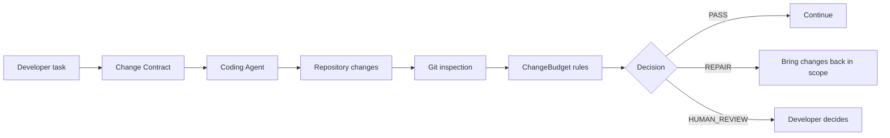

<div align="center">

# ⚡ ChangeBudget

### Keep AI coding changes inside the scope you approved.

**Small task ≠ giant diff.**

<p>
  
  
  
  
  
  
</p>

Scope contracts for coding agents. ChangeBudget records what a task is allowed to change, inspects the real Git state, and reports whether the result is inside the approved boundary.

No cloud policy engine. No telemetry. No LLM required at runtime.

</div>

<p align="center">
  <a href="#-quick-start">🚀 Quick Start</a> •
  <a href="#-show-me-code">💻 Show Me Code</a> •
  <a href="#-how-the-agent-discovers-changebudget">🤖 Agent Discovery</a> •
  <a href="#-how-it-works">🧠 How It Works</a> •
  <a href="#-roadmap">🗺️ Roadmap</a>
</p>

## The Problem

A small request can become a large, difficult-to-review diff:

```text
Task:
"Add an empty state to the player"

Expected:
3 files
~100 lines

Agent result:
17 files
new dependency
navigation refactor
configuration changes
full-project cleanup
```

The agent may produce valid code and still exceed the change the developer intended.

## The Solution

ChangeBudget turns the intended scope into a **Change Contract**, then compares the repository's actual Git changes with that contract.

```text
Task
  ↓
Change Contract
  ↓
Agent implements
  ↓
Git inspection
  ↓
Deterministic rules
  ↓
PASS / REPAIR / HUMAN_REVIEW
```

> The agent proposes code. The developer owns the boundaries.

ChangeBudget is deterministic, local-first, Git-backed, explainable, and usable without an LLM. Git and explicit ChangeBudget rules decide compliance; the LLM uses the framework but does not control its policy.

## 🚀 Quick Start

The recommended first run is three separate steps.

### Step 1 — Install ChangeBudget

```bash
npm install -g --ignore-scripts --allow-git=all --install-links=true git+https://github.com/Edulynch/Opencode-ChangeBudget.git#v1.1.7
```

This installs the immutable `v1.1.7` Git tag globally. ChangeBudget is currently installed from GitHub, not the npm registry. The repository is private, so authorized GitHub read access is required.

### Step 2 — Integrate ChangeBudget into the project

From the target Git repository:

```bash
changebudget integrate opencode
```

This creates or updates the project-local OpenCode integration:

- `.opencode/instructions/changebudget.md`
- `.opencode/plugins/changebudget.js`
- the ChangeBudget instruction entry in `opencode.json`

The operation is idempotent and manages only its own marked resources. The core CLI remains independent of OpenCode.

### Step 3 — Start coding

Open OpenCode and describe the task normally:

```text
Implement T031
```

or:

```text
Add pagination to the users endpoint. Keep the change minimal.
```

That's it. OpenCode loads the project instructions automatically, so the coding agent is explicitly told how to use the ChangeBudget lifecycle during implementation. This automatic discovery currently refers specifically to the OpenCode integration; it is not a claim that every model or coding tool supports it.

To inspect command syntax without executing a command, run `changebudget <command> --help` or `changebudget help <command>`.

## 💻 Show Me Code

The developer gives the implementation request. The integrated coding agent handles the ChangeBudget ceremony according to the project instructions, while the developer keeps authority if more scope is required.

The following is an illustrative workflow, not a promise of fixed prose output:

```text
You:
"Implement T031"

Agent:
- runs `changebudget status`
- if the repository is uninitialized, runs `changebudget init` and checks status again
- if no contract is active, runs `changebudget diagnose T031`
- starts the appropriate contract, such as `changebudget start T031 --tiny`
- implements the task and runs targeted validation
- runs `changebudget check`
- repairs an in-scope violation without widening the contract
- runs `changebudget close` only after validation and PASS
```

For a project without Spec-Kit:

```text
You:
"Add pagination to the users endpoint. Keep the change minimal."

Agent:
- checks ChangeBudget state
- establishes the appropriate contract
- implements only within the approved scope
- validates the implementation
- runs `changebudget check`
- closes the contract only after PASS
```

## 🤖 How the Agent Discovers ChangeBudget

`changebudget integrate opencode` creates and manages the project-local integration. OpenCode loads the instruction entry from `opencode.json`, which makes the workflow explicit to the coding agent:

```text
Developer integrates once
        ↓
changebudget integrate opencode
        ↓
Project-local instructions + Runtime Guard
        ↓
OpenCode loads project instructions
        ↓
Agent discovers the ChangeBudget lifecycle
        ↓
status → diagnose/start → implement → check → close
```

The generated instructions tell the agent to:

**Before implementation**

- run `changebudget status`;
- if the repository is uninitialized, run `changebudget init` and check status again;
- start a contract if none is active;
- for a Spec-Kit `Txxx` task without an explicit budget, run `changebudget diagnose Txxx`;
- never widen a contract automatically.

**During implementation**

- stay inside allowed paths;
- never manually modify `.changebudget/**`;
- respect protected and denied paths.

**After implementation**

- run targeted validation;
- run `changebudget check`;
- repair violations without widening the contract;
- run `changebudget close` only after validation succeeds.

There is no special ChangeBudget model, no required prompt to paste every session, and no persistent model memory involved. The integration is project-local and idempotent. ChangeBudget can also be used manually or by another coding agent capable of invoking commands. Automatic instruction discovery documented here targets OpenCode only; support for Cursor, Claude Code, Copilot, Aider, or other agents is not implied.

## 🧠 How It Works



The enforcement core is intentionally simple:

`Git + explicit rules + deterministic evaluation`

The diff is the source of truth, not the agent's description of what it changed. ChangeBudget can evaluate staged, unstaged, untracked, deleted, renamed, and binary Git changes. Its own `.changebudget/**` metadata is excluded from the user budget.

## Decisions

### PASS

Repository state satisfies the active contract.

### REPAIR

A deterministic violation exists. Bring the implementation back inside the already-approved contract.

### HUMAN_REVIEW

Developer authority is required because ChangeBudget cannot safely continue under the current contract or environment.

ChangeBudget never automatically widens a contract, raises a budget, rewrites permissions, reverts work, or deletes user files.

| Decision | Exit code |
|---|---:|
| `PASS` | `0` |
| `REPAIR` | `1` |
| `HUMAN_REVIEW` | `2` |

## What ChangeBudget Guards

| Guard | What it controls |
|---|---|
| Allowed paths | Which repository paths a task may touch |
| Denied paths | Protected paths that remain unavailable |
| Maximum files | The number of changed files |
| Maximum lines | Added plus deleted lines |
| New files | Whether file creation is allowed |
| Dependencies | Dependency-sensitive changes |
| Migrations | Migration paths and changes |
| Configuration | Configuration-sensitive files |
| Public API | Explicitly classified API-sensitive files |
| Stack policies | Android, Flutter, Spring Boot, and Node/TypeScript rule packs |
| Spec-Kit tasks | Deterministic association with `Txxx` tasks |
| Runtime Guard | Optional project-local OpenCode `allow` / `ask` / `deny` behavior |
| Diagnose advisor | Read-only budget recommendation before implementation |

## Command Reference

| Command | Purpose |
|---|---|
| `changebudget init` | Initialize ChangeBudget state in the current Git repository |
| `changebudget diagnose` | Recommend a deterministic budget before implementation |
| `changebudget start` | Open a Change Contract |
| `changebudget status` | Inspect lifecycle state and the active contract |
| `changebudget check` | Compare real Git changes with the active contract |
| `changebudget close` | Close a validated contract |
| `changebudget integrate opencode` | Install or update project-local OpenCode integration |
| `changebudget update --check` | Check for a compatible ChangeBudget update |

Useful options include `--json` for `check`, `status --budget`, and `diagnose`; contract presets `--tiny`, `--normal`, and `--free`; `--allow-path`, `--deny-path`, `--max-files`, `--max-changed-lines`, and `--stack-profile`; and `integrate opencode --dry-run` or `--remove`.

## OpenCode Runtime Guard

ChangeBudget policy and the OpenCode Runtime Guard are separate layers:

| ChangeBudget policy | Runtime Guard action |
|---|---|
| Deterministic contract evaluation | Runtime `allow`, `ask`, or `deny` behavior |
| `PASS` | Allow known in-scope work |
| Risky or unresolved context | Ask when explicit review is appropriate |
| `REPAIR`, unsafe mutation, or protected state | Deny or block |

The project-local Runtime Guard can allow known in-scope writes, ask again for risky operations, deny protected paths, protect `.changebudget/**`, and fail safely when a mutation target cannot be resolved. It remains local and is not an operating-system sandbox.

The normal installation path is `changebudget integrate opencode`; users do not need to build the repository or hand-write a plugin wrapper first.

## Spec-Kit

ChangeBudget can associate a contract with an existing Spec-Kit task without replacing or modifying Spec-Kit:

```bash
changebudget diagnose T031
changebudget start T031 --tiny
```

`Txxx` resolution is deterministic. Task metadata is captured when the contract starts. ChangeBudget never modifies `tasks.md`, marks tasks complete, invokes `/speckit.*`, or treats `PASS` as proof that a Spec-Kit task is complete.

Task lines may define a default:

```markdown
- [ ] T031 [budget:tiny] Implement task bridge
```

Precedence is deterministic: explicit CLI budget, then task `[budget:...]` default, then normal contract behavior. Projects without Spec-Kit work normally.

## Diagnose & Budget Advisor

`diagnose` is a deterministic, read-only advisor based on observable repository and task evidence. It is not an LLM, does not enforce the result, and cannot widen an active contract.

Possible recommendations are `tiny`, `normal`, `free`, or `manual review`:

```bash
changebudget diagnose --allow-path "src/player/**"
changebudget diagnose T031 --json
```

It does not create contracts, modify `.changebudget/**`, modify project files, modify Spec-Kit tasks, or invoke OpenCode.

## Stack Policies

Stack policies are deterministic rule packs, not semantic AI analysis. Current profiles are:

- **Android**: Gradle, manifests, signing, release, and protected configuration surfaces.
- **Flutter**: `pubspec`, analysis configuration, platform, and release surfaces.
- **Spring Boot**: Maven/Gradle dependencies, application configuration, and migration paths.
- **Node / TypeScript**: `package.json`, lockfiles, TypeScript configuration, and selected public API surfaces.

Select a profile when starting a contract:

```bash
changebudget start --task "Update application config" --base-revision HEAD --stack-profile spring-boot --max-files 5 --max-changed-lines 150
```

Repository overrides live in `.changebudget/stack-policy-overrides.json`; individual rules can be disabled with `--disable-stack-rule <rule-id>`.

## 🗺️ Roadmap

### ✅ Shipped

- Local Change Contract lifecycle and deterministic Git budget engine.
- `PASS`, `REPAIR`, and `HUMAN_REVIEW` results with reports and exit codes.
- OpenCode Runtime Guard and project-local `integrate opencode` workflow.
- Android, Flutter, Spring Boot, and Node/TypeScript stack policies.
- Spec-Kit task bridge and deterministic diagnose advisor.
- Personal v1.0 reliability hardening.
- Immutable tagged installation, Windows/Linux CI, and tagged-smoke validation.
- SPEC-012 complete: immutable `v1.1.5` tagged smoke passed on Ubuntu and Windows.

The roadmap's explicitly deferred items remain deferred: cloud services, dashboards, accounts, billing, marketplaces, remote execution, full OS sandboxing, silent auto-repair, LLM-based compliance, and public npm publication.

[View the full roadmap →](ChangeBudget_Roadmap.md)

## Release & Validation

Current release: **`v1.1.7`**

- Normal CI runs on Windows and Ubuntu.
- Windows test execution uses native Node sharding.
- Immutable release tags are smoke-tested on Windows and Ubuntu.
- The real `v1.1.5` tagged-install smoke passed in run `32627687768`; immutable `v1.1.6` tagged-install smoke passed in run `32639180554`; the `v1.1.7` smoke is pending release validation.
- SPEC-012 is complete.
- GitHub Release publication remains a manual maintainer action after both tagged-smoke jobs pass.

The repository is private. Tagged smoke uses only ephemeral read-only workflow access at the Git authentication boundary; it does not require a PAT, custom secret, SSH key, `gh`, or a personal credential helper.

## Design Principles

- **Local-first:** no backend or account is required for normal operation.
- **Deterministic:** Git and explicit rules decide compliance.
- **Human authority:** agents cannot authorize their own scope expansion.
- **Explainable:** violations expose rules, paths, and reason codes.
- **No silent destruction:** validation does not revert or delete user work.
- **Fast-path friendly:** small tasks should have a small workflow.
- **No LLM required at runtime:** AI may write code; it does not decide policy.
- **Zero telemetry by default:** code, diffs, and project paths stay local.

## 🛠️ Development

This is for working on ChangeBudget itself, not the normal end-user installation path.

Requirements: Node.js 20+, Git, and npm.

```bash
npm install
npm run build
npm run typecheck
npm test
```

## Project Structure

```text
ChangeBudget/
├── src/                    # CLI, Git inspection, rules, state, and policies
├── opencode-plugin/        # OpenCode Runtime Guard package
├── tests/                  # Unit, integration, acceptance, and contract tests
├── specs/                  # Spec-Kit feature artifacts
├── .specify/               # Spec-Kit project configuration
└── ChangeBudget_Roadmap.md
```

## Deliberate Non-Goals

ChangeBudget does not provide a cloud backend, accounts, teams, telemetry, a web dashboard, remote code execution, a general shell parser, a full operating-system sandbox, universal AST analysis, LLM-based compliance decisions, automatic rollback, silent contract widening, or a public policy marketplace.

## License

MIT
