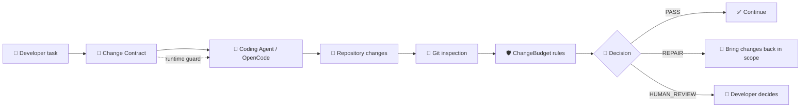

<div align="center">

# ⚡ ChangeBudget

### Deterministic scope guardrails for coding agents

**Small task ≠ giant diff 😅**

<p>
  
  
  
  
  
</p>

ChangeBudget is a local CLI that lets **you** define the allowed change surface for a task, then checks the real Git state to verify whether a coding agent stayed inside that contract.

No cloud. No telemetry. No LLM required at runtime. Your agent does **not** get to silently expand its own scope. 🛡️

</div>

---

## 🎯 Why?

Coding agents are powerful, but a small request can easily turn into a much larger change:

```text
Task:
"Add an empty state to the player"

Expected:
3 files
~100 lines

Agent result:
17 files
new dependency
navigation refactor
configuration changes
full-project cleanup 😅
```

ChangeBudget turns the expected scope into a **Change Contract** and evaluates what actually happened in Git.

> **The agent proposes code. The developer owns the boundaries.**

---

## 🧠 How it works



The core is intentionally boring in the best possible way: Git + explicit rules + deterministic evaluation.

---

## 🛡️ What ChangeBudget can guard

| Guard | What it controls |
|---|---|
| 📂 Allowed paths | Which repository paths a task may touch |
| ⛔ Denied paths | Paths that remain protected even inside broader allow rules |
| 📁 File budget | Maximum number of changed files |
| 📏 Line budget | Maximum added + deleted lines |
| 🆕 New files | Allow or reject file creation |
| 📦 Dependencies | Detect dependency-sensitive changes |
| 🗃️ Migrations | Protect migration paths |
| ⚙️ Configuration | Protect configuration-sensitive files |
| 🔌 Public API | Guard explicitly classified API-sensitive files |
| 🧩 Stack policies | Android, Flutter, Spring Boot and Node/TypeScript presets |
| 🔗 Spec-Kit tasks | Associate contracts with deterministic `Txxx` tasks without modifying Spec-Kit |
| 🤖 Runtime guard | Optional OpenCode integration with `allow` / `ask` / `deny` |
| 🔎 Diagnose advisor | Recommend a deterministic budget before implementation without modifying repository state |

ChangeBudget also handles staged, unstaged, untracked, deleted, renamed and binary Git changes without counting its own `.changebudget/**` metadata against the user budget.

---

## 🚦 Decisions

ChangeBudget has three workflow-level outcomes:

### ✅ PASS

The repository state satisfies the active contract.

### 🔧 REPAIR

There is a concrete deterministic violation. The implementation should be brought back inside the **already approved** contract.

### 👤 HUMAN_REVIEW

Developer authority is required because ChangeBudget cannot safely continue under the current contract or environment.

Examples include invalid state, an unresolved base revision, or a condition that requires an explicit human decision.

> ChangeBudget never widens a contract, raises a budget or rewrites permissions automatically.

Decision exit codes are intentionally script-friendly:

| Decision | Exit code |
|---|---:|
| `PASS` | `0` |
| `REPAIR` | `1` |
| `HUMAN_REVIEW` | `2` |

---

## 📦 Local setup

ChangeBudget is currently a personal/local tool rather than a published npm package.

### Requirements

- Node.js 20+
- Git available in `PATH`
- npm

### Build from source

```bash
npm install
npm run build
npm run typecheck
npm test
```

Run the CLI directly:

```bash
node dist/src/cli/index.js --help
```

Or create a local npm link so `changebudget` is available as a command:

```bash
npm link
changebudget --help
```

---

## 🚀 Quick start

Inside a Git repository:

```bash
changebudget init
```

Start a small contract:

```bash
changebudget start --task "Add player empty-state handling" --base-revision HEAD --allow-path "src/player/**" --allow-path "tests/player/**" --max-files 4 --max-changed-lines 250 --stack-profile node-ts
```

If the repository uses Spec-Kit, the same contract can start from a task ID:

```bash
changebudget start T031 --tiny
```

Inspect it:

```bash
changebudget status
changebudget status --budget
```

Evaluate the real Git state:

```bash
changebudget check
```

Machine-readable output is also available:

```bash
changebudget check --json
changebudget status --budget --json
```

Close the contract when the task is done:

```bash
changebudget close
```

### Contract knobs

A contract can currently define things such as:

```text
allow_paths
  src/player/**
  tests/player/**

deny_paths
  src/security/**

max_files            4
max_changed_lines    250
allow_new_files      false
allow_new_dependencies false
allow_migrations     false
allow_config_changes false
allow_public_api_changes false
stack_profile        node-ts
```

Presets are also available: `tiny`, `normal`, `free`, and `custom`.

---

## 📊 Example check

Human output is deliberately explicit:

```text
Decision: REPAIR
Contract source: active
Contract id: contract-...
Base revision: HEAD
Status: FAIL
Changed files: 5
Changed lines: 214

Violations:
  - path_scope: File is outside the approved path scope
    [path=src/core/router.ts, reason_code=CBV-PATH-NOT-ALLOWED, action=repair]

Reason codes: CBV-PATH-NOT-ALLOWED
```

No hidden score. No probabilistic classifier. The result is derived from observable repository state and contract rules.

---

## 🤖 OpenCode Runtime Guard

SPEC-004 adds an **optional** project-local OpenCode adapter.

The core CLI remains independent from OpenCode; the plugin is only a runtime guardrail layer.

### ChangeBudget policy vs OpenCode action

| ChangeBudget | Runtime action |
|---|---|
| `PASS` | `allow` |
| risky/out-of-scope deterministic context | `ask` when explicit review is appropriate |
| `REPAIR` / unsafe unresolved mutation / protected state | `deny` / block |

The runtime guard can:

- ✅ allow known in-scope writes
- ❓ ask again for risky/out-of-scope operations instead of caching approval
- ⛔ block denied paths
- 🔒 hard-protect `.changebudget/**` from agent tampering
- 🧯 fail safely when a mutation target cannot be resolved deterministically
- 📦 recognize dependency/config/migration/public-API-sensitive mutation contexts
- 🏠 stay completely local

### Project-local plugin shape

Build ChangeBudget first:

```bash
npm run build
```

Then a target OpenCode repository can expose the compiled plugin through its project-local `.opencode/plugins/` directory. During development, a thin wrapper can point at the local compiled module:

```js
export { default } from "file:///ABSOLUTE/PATH/TO/ChangeBudget/opencode-plugin/dist/opencode-plugin/src/index.js";
```

> The runtime guard is a workflow guardrail, **not an operating-system sandbox**.

See [`specs/004-opencode-runtime-guard/quickstart.md`](specs/004-opencode-runtime-guard/quickstart.md) for the current validation scenarios.

---

## 🧩 Personal stack policies

Stack policies are deterministic path/rule packs layered on top of the existing budget engine. They are **not** semantic AI analysis.

### 🤖 Android

Representative protected surfaces include:

- Gradle configuration and dependency files
- `AndroidManifest.xml`
- release/signing-related paths
- repository-defined overrides

### 💙 Flutter

Representative rules include:

- `pubspec.yaml`
- `pubspec.lock`
- Flutter configuration such as `analysis_options.yaml`
- release pipeline paths

### 🍃 Spring Boot

Representative rules include:

- `pom.xml` / Gradle dependency files
- `application*.yml`, `.yaml`, `.properties`
- Flyway-style migration SQL paths
- Liquibase `db/changelog/**` paths

### 🟦 Node / TypeScript

Representative rules include:

- `tsconfig*.json`
- `package.json`
- dependency lockfiles
- selected public API entry points

Choose a profile when starting the contract:

```bash
changebudget start --task "Update application config" --base-revision HEAD --stack-profile spring-boot --max-files 5 --max-changed-lines 150
```

Rules can also be adjusted locally through repository overrides in:

```text
.changebudget/stack-policy-overrides.json
```

and selectively disabled per contract with:

```bash
--disable-stack-rule <rule-id>
```

Invalid or cross-profile disabled rule IDs are rejected during `start` before the contract is persisted.

See [`specs/005-personal-stack-policies/quickstart.md`](specs/005-personal-stack-policies/quickstart.md) for examples.

---

## 🔗 Spec-Kit Task Bridge

ChangeBudget can associate a contract with an existing Spec-Kit task without replacing or modifying Spec-Kit. The task is resolved deterministically from the local `specs/<feature>/tasks.md`, and the resolved metadata is persisted in the Change Contract.

The following is stored at `start` time:

- task ID (canonical `Txxx`)
- task title
- source feature directory
- source `tasks.md` path

The full lifecycle works like any other contract:

```bash
changebudget start T031 --tiny
changebudget status
# implement + targeted validation
changebudget check
changebudget close
```

Guarantees:

- exact `Txxx` resolution is deterministic
- unknown task IDs fail
- ambiguous duplicate IDs fail rather than being guessed
- task metadata captured at `start` is reused by `status` / `check` / `close`
- ChangeBudget never modifies `tasks.md`
- ChangeBudget never changes `[ ]` to `[x]`
- ChangeBudget never invokes `/speckit.*`
- a `PASS` result does **not** mean the Spec-Kit task is automatically complete
- projects without Spec-Kit continue working normally

### Task budget defaults

A task can declare a deterministic budget default in its task line:

```markdown
- [ ] T031 [budget:tiny] Implement task bridge
```

Precedence:

```text
explicit CLI budget > task [budget:...] default > existing/default contract behavior
```

So `changebudget start T031` uses `[budget:tiny]` when present, while `changebudget start T031 --normal` uses `normal`, overriding the task default.

This is deterministic configuration, **not** AI budget recommendation. For a pre-implementation recommendation, see the [🔎 Diagnose & Budget Advisor](#diagnose--budget-advisor) section below.

See [`specs/006-spec-kit-task-bridge/quickstart.md`](specs/006-spec-kit-task-bridge/quickstart.md) for the complete scenarios.

---

## 🔎 Diagnose & Budget Advisor

Not sure how big a task will be? `changebudget diagnose` helps you choose a budget **before** implementation. It inspects observable repository state — no Change Contract required — and recommends a deterministic budget.

Possible outcomes:

- `tiny`
- `normal`
- `free`
- `manual review`

### Examples

Structural diagnosis from explicit paths:

```bash
changebudget diagnose --allow-path "src/player/**"
```

Spec-Kit task diagnosis reusing the deterministic `Txxx` resolution (including an explicit `[budget:...]` task default):

```bash
changebudget diagnose T031
```

Machine-readable output is also available:

```bash
changebudget diagnose --allow-path "src/player/**" --json
```

### Advisory only

Recommendations are **advisory only** — `diagnose` is not enforcement:

- `diagnose` never creates a Change Contract
- `diagnose` never widens an existing contract
- `diagnose` never modifies `.changebudget/**`
- `diagnose` never modifies project files
- `diagnose` never modifies Spec-Kit tasks
- `diagnose` does not invoke OpenCode or Spec-Kit
- no LLM/AI is used
- recommendations are deterministic and explainable, with ordered observable evidence for every outcome

See [`specs/007-diagnose-budget-advisor/quickstart.md`](specs/007-diagnose-budget-advisor/quickstart.md) for the current validation scenarios.

---

## 🔒 Design principles

| Principle | Meaning |
|---|---|
| 🏠 **Local-first** | No backend, account or cloud service is required |
| 🎯 **Deterministic** | Git and explicit rules decide compliance |
| 👤 **Human authority** | The agent cannot authorize its own scope expansion |
| 🪶 **Minimal architecture** | No infrastructure “just in case” |
| 🔍 **Explainable** | Violations expose rules, paths and reason codes |
| 🚫 **No silent destruction** | `check` does not revert or delete user work |
| ⚡ **Fast path friendly** | Small tasks should stay small |
| 🤖 **No LLM required at runtime** | AI may write code; it does not decide policy |
| 🔐 **Zero telemetry by default** | Code, diffs and project paths stay local |

---

## 🧪 Testing

The repository includes:

- unit tests for lifecycle, parsing, validation, projection and policy rules
- temporary Git repository integration tests
- CLI end-to-end lifecycle/check tests
- OpenCode Runtime Guard hook integration coverage
- SPEC-006 unit/integration coverage for deterministic task resolution
- lifecycle/read-only/no-Spec-Kit compatibility tests
- quantitative acceptance metrics for stack policy (SPEC-005), task-bridge (SPEC-006) and diagnose-advisor (SPEC-007) behavior

Run the complete quality gate with:

```bash
npm test
npm run typecheck
npm run build
```

SPEC-005 acceptance evidence lives in [`specs/005-personal-stack-policies/acceptance-metrics.md`](specs/005-personal-stack-policies/acceptance-metrics.md).

SPEC-006 acceptance evidence lives in [`specs/006-spec-kit-task-bridge/acceptance-metrics.md`](specs/006-spec-kit-task-bridge/acceptance-metrics.md).

SPEC-007 acceptance evidence lives in [`specs/007-diagnose-budget-advisor/acceptance-metrics.md`](specs/007-diagnose-budget-advisor/acceptance-metrics.md).

---

## 🗺️ Project progress

| Spec | Status | What it delivered |
|---|---|---|
| SPEC-001 — Local Change Contract Lifecycle | ✅ Complete | `init`, `start`, `status`, `check`, `close` lifecycle |
| SPEC-002 — Deterministic Git Budget Engine | ✅ Complete | Real Git diff/budget/path evaluation |
| SPEC-003 — Policy Results, Reports & Exit Codes | ✅ Complete | `PASS`, `REPAIR`, `HUMAN_REVIEW`, JSON and exit codes |
| SPEC-004 — OpenCode Runtime Guard | ✅ Complete | Optional runtime guardrails for OpenCode |
| SPEC-005 — Personal Stack Policies | ✅ Complete | Android, Flutter, Spring Boot and Node/TS rule packs |
| SPEC-006 — Spec-Kit Task Bridge | ✅ Complete | Deterministic association with Spec-Kit `Txxx` tasks, persisted task metadata, fast path and deterministic task budget defaults |
| SPEC-007 — Diagnose & Budget Advisor | ✅ Complete | Deterministic read-only budget advisor: `tiny` / `normal` / `free` / `manual review`, with explainable observable evidence and no automatic contract creation or widening |
| SPEC-008 — Dogfood & Hardening | 🧭 Planned | Real-world robustness and personal v1.0 |

The detailed roadmap is in [`ChangeBudget_Roadmap.md`](ChangeBudget_Roadmap.md).

---

## 🧱 Project structure

```text
ChangeBudget/
├── src/
│   ├── cli/                 # CLI commands, parsing and output
│   ├── core/                # Git inspection, rules, state, policies and spec-kit bridge
│   └── models/              # Contracts, lifecycle and result types
├── opencode-plugin/         # Optional OpenCode runtime guard
├── tests/
│   ├── unit/
│   ├── integration/
│   └── acceptance/
├── specs/                   # Spec-Kit feature artifacts
├── .specify/                # Spec-Kit project configuration
└── ChangeBudget_Roadmap.md
```

---

## 🚧 What ChangeBudget deliberately does **not** do

ChangeBudget is intentionally small. It currently does **not** provide:

- ☁️ cloud backend or remote database
- 👥 accounts, teams or multi-tenancy
- 📈 telemetry or silent analytics
- 🧠 LLM-based compliance decisions
- 🔄 automatic repair or rollback
- 📜 automatic contract widening
- 🐚 a general shell parser or sandbox
- 🔬 universal AST / semantic code analysis
- 🛍️ downloadable policy marketplace
- 🌐 web dashboard

Less machinery. More control. ✨

---

## 🌱 Project status

ChangeBudget is currently a **personal developer tool** built for real day-to-day coding-agent workflows.

The priority is usefulness, determinism and dogfooding—not turning it into a SaaS platform. It may become open source later, once the workflow is mature enough to justify it.

<div align="center">

### ⚡ Define the scope. Let the agent work. Verify the diff.

`task → contract → implement → targeted validation → check → close`

</div>
